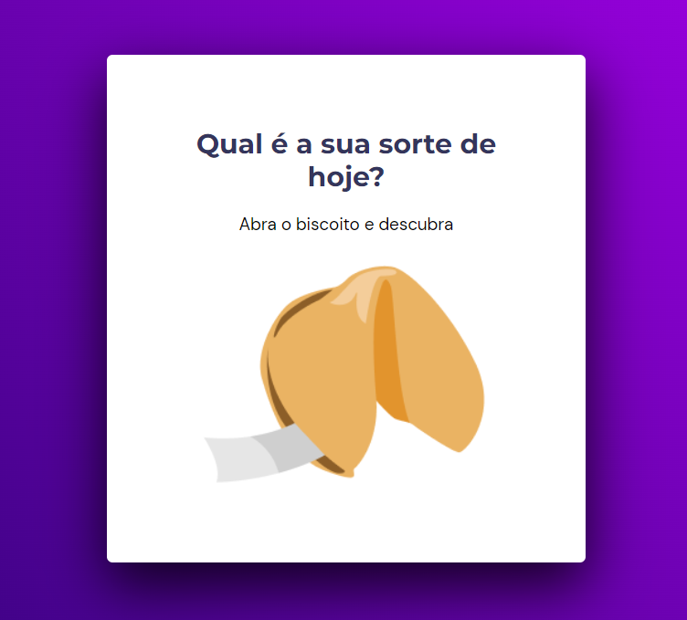

<h1 align="center"> Biscoito da Sorte </h1>

O projeto Biscoito da Sorte foi desenvolvido durante o stage 05 no Explorer da Rocketseat. No projeto, foi desenvolvido um site para gerar uma "sorte" após clicar no biscoito. Quando o mouse fica sobre o biscoito, ele compeça a vibrar, passando a ideia de que ira quebrar. Apenas gerar a frase da sorte, é possível abrir um novo biscoito clicando no botãou ou apretando a tecla "Enter".  

  

## 🚀 Tecnologias

Esse projeto foi desenvolvido com as seguintes tecnologias:

- HTML, CSS e JavaScript
- Git e Github
- Figma

[Acesse o projeto finalizado, online](https://marcelgava.github.io/stage05-desafio01-biscoito-da-sorte/)
